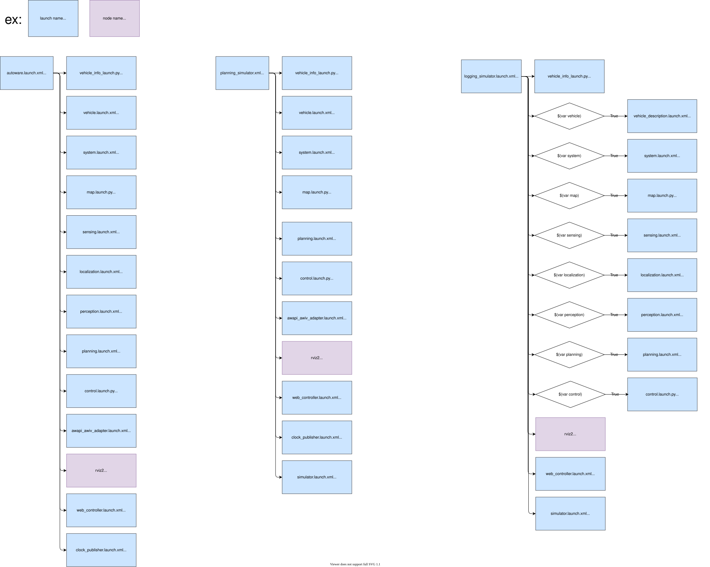

# max_launch

This launch package is based on autoware_launch with configuration changes specific for the **Roboracer Max**. Configuration changes as well as the reasoning are described below.

## Configuration Changes

### Context

These changes are designed for a **Roboracer Max, a 1/5 scale RC vehicle operating on uneven, hilly terrain**. Due to the vehicle’s small size and LiDAR placement, the sensor has a limited vertical field of view and often fails to capture enough of the ground surface when traversing hill crests, dips, or banked turns. As a result, the system frequently operates on sparse or incomplete point clouds, which negatively impacts scan matching, localization, and downstream modules.

In practice, this led to unstable localization and frequent false-positive instability detections, leading to emergency braking. Additionally, when driving downhill the LiDAR often interprets the ground ahead as an obstacle, triggering unnecessary stopping behavior. The following changes relax strict thresholds and disable modules that are not well-suited for this scale and terrain, improving overall robustness at the cost of reduced conservatism.

---

## Modified Files and Changes

### Localization

#### `autoware_launch/config/localization/localization_error_monitor.param.yaml`
- `error_ellipse_size_lateral_direction`: **0.3 → 1.0**
- `warn_ellipse_size_lateral_direction`: **0.25 → 0.7**

**Reasoning:**  
Increase tolerance to lateral drift caused by reduced feature visibility on uneven terrain.

---

#### `autoware_launch/config/localization/ndt_scan_matcher/ndt_scan_matcher.param.yaml`
- `required_distance`: **10.0 → 1.0**
- `converged_param_nearest_voxel_transformation_likelihood`: **2.3 → 0.5**

**Reasoning:**  
Allows scan matching to proceed with short-range or sparse LiDAR data and reduces rejection of imperfect (but usable) matches.

---

#### `autoware_launch/config/localization/pose_initializer.param.yaml`
- `stop_check_enabled`: **set to false (overridden)**

**Reasoning:**  
Prevents initialization failures caused by unreliable stop detection under noisy localization conditions.

---

#### `autoware_launch/config/localization/pose_instability_detector.param.yaml`
- `pose_estimator_longitudinal_tolerance`: **0.11 → 0.5**
- `pose_estimator_angular_tolerance`: **0.0175 → 0.1**

**Reasoning:**  
Accounts for pitch changes and pose variation on hills, reducing false instability triggers.

---

### Perception

#### `autoware_launch/config/perception/obstacle_segmentation/ground_segmentation/ground_segmentation.param.yaml`
- `global_slope_max_angle_deg`: **10.0 → 20.0**
- `local_slope_max_angle_deg`: **13.0 → 25.0**

**Reasoning:**  
Improves ground classification on steep slopes and banked terrain.

---

### Planning

#### `autoware_launch/config/planning/mission_planning/mission_planner/mission_planner.param.yaml`
- `reroute_time_threshold`: **10.0 → 1.0**
- `minimum_reroute_length`: **30.0 → 1.0**

**Reasoning:**  
Enables faster rerouting in dynamic or unstable localization conditions.

---

#### `autoware_launch/config/planning/preset/default_preset.yaml`

The following modules were disabled (set `"true"` → `"false"`):
- obstacle stop  
- obstacle slow down  
- obstacle cruise  
- dynamic obstacle stop  
- out-of-lane  
- obstacle velocity limiter  
- run-out  
- road user stop  

**Reasoning:**  
When driving downhill, the LiDAR frequently detects the ground ahead as an obstacle. This results in false positives that trigger unnecessary stopping or oscillatory behavior. These modules are tuned for full-scale vehicles in structured environments and are not robust to the geometry and sensing limitations of a small RC platform on uneven terrain.

---

## Trade-offs

These changes improve robustness and drivability on uneven terrain by increasing tolerance to noisy or incomplete LiDAR data and by removing modules that misinterpret the environment. However, they also reduce strict safety checks and disable several obstacle handling behaviors, making this configuration unsuitable for full-scale or safety-critical deployments without further validation.

---

## Structure



## Package Dependencies

Please see `<exec_depend>` in `package.xml`.

## Usage

You can use the command as follows at shell script to launch `*.launch.xml` in `launch` directory.

```bash
ros2 launch max_launch autoware.launch.xml map_path:=/path/to/map_folder vehicle_model:=lexus sensor_model:=aip_xx1
```
